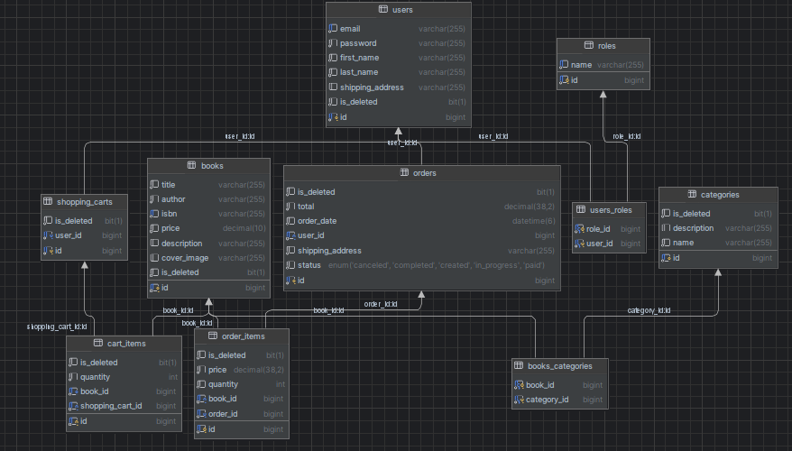

# <h1 align="center">📖 Novel Nebula 📖 </h1>

 <b> Online Bookshop App </b>

## Introduction

**_Welcome to Novel Nebula app!_** ⭐

This is a handy and secure app which allows users to make purchases online.
Admins can add new books to DB, all books have categories, so it is easy to filter and find them by category.
A books that user plans to buy they add to a shopping cart. After creating an order 
the shopping cart is cleared. 
Before accessing the app user should authorize (enter email and password). As it is a RESTful application
JWT is used. It is sent to the user after login and protects access to the app.
All users are divided into admins and users which provides them with certain rights in the app.

* Do you want to **keep track** of the stock of books that there is in your shop?
* Do you want to use **handy** tool for that purpose?
* Are you **tired** of numerous pages of confusing documentation?
* Do you want to provide your customers with **enjoyable** way of making purchases in your bookshop?

[//]: # (* Moreover, customers won't be limited with open hours of the shop. This service will be  **available 24/7**.)

###  If you have ever faced any of the above problems, you are in the right place to solve them once and forever. 🎯

## Description of the project

### The following technologies have been used:
* **Java 17**
* **Spring boot**
* **Spring Data JPA**
* **Spring Security**
* **MySQL**
* **Swagger**
* **Lombok**
* **MapStruct**
* **Docker**
* **Liquibase**

## How to use the application?
1. Make sure you have JDK and Docker installed
2. Clone the repository from GitHub
3. Create .env file and fill in all necessary variables 
(You can find them in .env.sample)
4. Run the command mvn clean package
5. Run docker-compose up --build to build and start the Docker containers 
6. The application should be running at http://localhost:8081
7. Swagger is available for testing at http://localhost:8081/swagger-ui/index.html#/

## Database structure

## Controllers and endpoint available ⬇
All unauthenticated users can register and login. After users can see all books as well as info on only 
a certain book, they can see all categories and all books present in one category. 
Users can put a book into a shopping cart, change chosen quantity, delete it from shopping cart or see all
books that they added there before. Also, they can place an order, see their order history, items from a 
specific order.
Admins can modify DB: add a new book, update info on it or delete. They can do the same with categories.
Admins can also change status of a certain order.

## **Authentication Controller:**

| **HTTP method** |  **Endpoint**  | **Role** | **Function**                               |
|:---------------:|:--------------:|:--------:|:-------------------------------------------|
|      POST       | /auth/register |   ALL    | Allows a new user to register              |
|      POST       |  /auth/login   |   ALL    | Authenticates a user and returns JWT token |

---

## **Book Controller:** _Managing and browsing books_

| **HTTP method** | **Endpoint** | **Role** | **Function**                                            |
|:---------------:|:------------:|:--------:|:--------------------------------------------------------|
|       GET       |    /books    |   USER   | Enables users to get all books                          |
|       GET       | /books/{id}  |   USER   | Enables users to get info about one book                |
|      POST       |    /books    |  ADMIN   | Enables admins to create a new book and save it to DB   |
|       PUT       | /books/{id}  |  ADMIN   | Enables admins to update info on an existing in DB book |
|     DELETE      | /books/{id}  |  ADMIN   | Enables admins to delete a book from DB                 |

---
## **Category Controller:** _Managing and browsing categories_

| **HTTP method** |      **Endpoint**      | **Role** | **Function**                                                |
|:---------------:|:----------------------:|:--------:|:------------------------------------------------------------|
|       GET       |      /categories       |   USER   | Enables users to get all categories                         |
|       GET       | /categories/{id}/books |   USER   | Enables users to get all books in a certain category        |
|      POST       |      /categories       |  ADMIN   | Enables admins to create a new category and save it to DB   |
|       PUT       |    /categories/{id}    |  ADMIN   | Enables admins to update info on an existing in DB category |
|     DELETE      |    /categories/{id}    |  ADMIN   | Enables admins to delete a category from DB                 |

---

## **Shopping Cart Controller:** _Managing and browsing cart items in shopping cart_

| **HTTP method** |         **Endpoint**          | **Role** | **Function**                                                                |
|:---------------:|:-----------------------------:|:--------:|:----------------------------------------------------------------------------|
|       GET       |             /cart             |   USER   | Enables users to get all cart items (books) in their shopping carts         |
|       PUT       | /cart/cart-items/{cartItemId} |   USER   | Enables users to change book quantity in a cart item in their shopping cart |
|      POST       |             /cart             |   USER   | Enables users to add a cart item (book) to their shopping cart              |
|     DELETE      | /cart/cart-items/{cartItemId} |   USER   | Enables users to delete a cart item from their shopping cart                |

---

## **Order Controller:** _Managing and browsing order and order items_

| **HTTP method** |         **Endpoint**         | **Role** | **Function**                                                   |
|:---------------:|:----------------------------:|:--------:|:---------------------------------------------------------------|
|      POST       |           /orders            |   USER   | Enables users to create a new order                            |
|       GET       |           /orders            |   USER   | Enables users to get their order history                       |
|      PATCH      |      /orders/{orderId}       |  ADMIN   | Enables admins to change status of a certain order             |
|       GET       |   /orders/{orderId}/items    |   USER   | Enables users to get all order items from a specific order     |
|       GET       | /orders/{orderId}/items/{id} |   USER   | Enables users to get a certain order item from a certain order |
---
